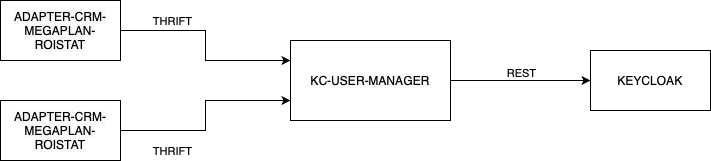
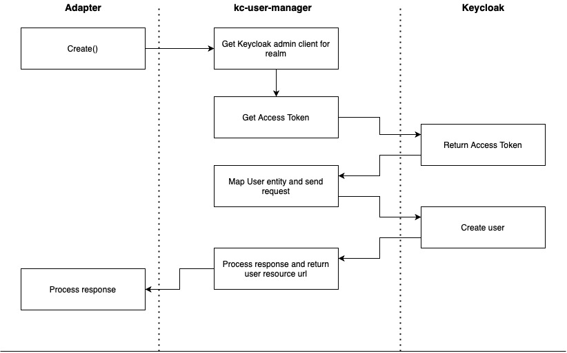
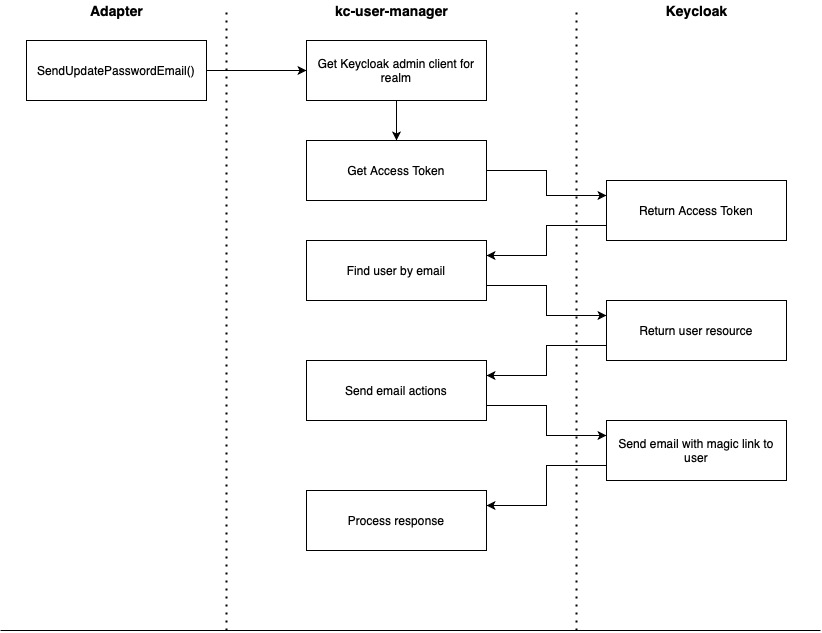

# kc-user-manager

## General
Service to manage keycloak users. <br>
- It can create user and send email actions: verify email and send magic link to set/update password.
- Service can work with different realms, each request must have realm specified
- List of available realms and connection parameters are set in application.yml
```yaml
keycloak:
  auth-server-url: http://localhost:8080/auth
    admin-clients:
      external:
        client-id: user-manager-service
        client-secret: 4f213624-7190-421f-9e3c-5198737a7d9c
        timeouts-ms: 10000
        pool-size: 2
      master:
        client-id: admin-cli
        client-secret: 7cfe46c7-90f7-4cae-a6cc-3ad7bb0296db
        timeouts-ms: 15000
        pool-size: 1
```


## Create user
Request:
```json
{
        "user_id": {
                "email": "ivan.sidorov@mail.ru",
                "realm": "external"
        },
        "first_name":"Ivan",
        "last_name":"Sidorov"
}
```

Response:
- User's resource value in Location header <br>
  http://localhost:8080/auth/admin/realms/master/users/91be9c23-2091-48e6-bf08-ee24102baa9d
- Username of created user is equal to email




## Email Actions
Few Methods have same logic and request entities:
- SendVerifyUserEmail
- SendUpdatePasswordEmail

```json
{
        "user_id": {
                "email": "ivan.sidorov@mail.ru",
                "realm": "external"
        },
        "redirect_params": {
                "client_id": "redirect-client",
                "redirect_uri": "https://www.youtube.com/watch?v=dQw4w9WgXcQ"
        }
}
```
Note:
- client_id has to exist in keycloak
- redirect_uri has to be within valid uris of specified client  


